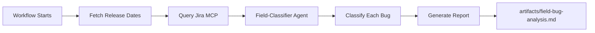

# Post-Release Bug Classifier Workflow

An automated Ambient Code Platform workflow that analyzes RHOAI bugs from Jira, classifies them by type, and identifies field-reported post-release issues.

## Overview

This workflow automatically executes a complete bug analysis pipeline when activated:

1. **Fetch Release Schedule** - Pulls RHOAI release dates from Google Sheets
2. **Query Jira** - Fetches recent bugs (90 days) from RHOAIENG project
3. **Classify Bugs** - Uses AI sub-agent to categorize by type and origin
4. **Generate Report** - Creates a concise findings report

**No manual intervention required** - the workflow runs start to finish automatically.

## What It Does

### Bug Type Classification

Bugs are categorized into four types:

| Type | Description | Examples |
|------|-------------|----------|
| **Functional** | Core features broken or not working | API errors, backend failures, data issues, workflow problems |
| **UX** | User interface and experience issues | Layout bugs, confusing UI, accessibility problems, poor usability |
| **Regression** | Previously working features now broken | "Used to work", "worked in 2.16", "after upgrade" |
| **Unknown** | Insufficient information to classify | Vague descriptions, needs investigation |

### Field Detection

Identifies bugs likely discovered by customers/field post-release based on:

- **Timing**: Created after the RHOAI version's release date
- **Reporter**: GSS, Support, CEE, Field engineers, customer-facing roles
- **Keywords**: "customer", "production", "field", "support case"
- **Labels/Components**: customer, field, support, gss, cee tags

## How to Use

### Loading in ACP

1. Navigate to your ACP session
2. Select **Custom Workflow** in the Workflows section
3. Enter the repository URL and path to `workflows/post-release-bugs`
4. The workflow starts automatically upon loading

### Configuration

The workflow is pre-configured with:

- **JQL Query**: `project = RHOAIENG AND issuetype = Bug AND status in (New, Backlog) AND created >= -90d`
- **Release Schedule**: Google Sheets ID `175QbjWjn1a1RfJzo33Fah_f5yPvBIb_2lF1js9iJhXk`
- **User Email**: `gkrumbac@redhat.com` (for MCP tool access)

To customize these, edit `.ambient/ambient.json`.

## Output

### Report Location
`artifacts/field-bug-analysis.md`

### Report Format

```markdown
# Field Bug Analysis Report
Generated: [timestamp]

## Summary
- Total bugs analyzed: 42
- Field-reported: 15 (36%)
- Classification breakdown:
  - Functional: 18
  - UX: 12
  - Regression: 8
  - Unknown: 4

## Functional Bugs (18)

| Issue | Summary | Field? | Reasoning |
|-------|---------|--------|-----------|
| RHOAIENG-1234 | API endpoint returns 500 | Yes | Created post-2.18 release, GSS reporter, customer label |
| RHOAIENG-1235 | Pipeline fails to execute | No | Created pre-release, internal engineer |
...

## UX Bugs (12)
...

## Regression Bugs (8)
...

## Unknown (4)
...
```

## Workflow Structure

```
workflows/post-release-bugs/
├── .ambient/
│   └── ambient.json              # Workflow configuration
├── .claude/
│   └── agents/
│       └── field-classifier.md   # Bug classification sub-agent
└── README.md                     # This file
```

## How It Works



### Pipeline Steps

1. **Fetch Release Dates**
   - Connects to Google Sheets via MCP
   - Reads RHOAI release schedule
   - Extracts version → release date mappings
   - Stores for field detection logic

2. **Query Jira**
   - Uses Jira MCP with configured JQL
   - Fetches bugs created in last 90 days
   - Status: New or Backlog
   - Gets full details: description, reporter, labels, components

3. **Classify Bugs**
   - Invokes field-classifier sub-agent
   - Analyzes each bug's description and metadata
   - Determines type: Functional/UX/Regression/Unknown
   - Determines field status: Yes/No based on indicators
   - Provides reasoning for each classification

4. **Generate Report**
   - Groups bugs by type
   - Creates markdown table for each category
   - Includes summary statistics
   - Outputs to `artifacts/field-bug-analysis.md`

## Classification Logic

### Type Classification

The field-classifier agent uses pattern matching and context analysis:

**Functional Bugs:**
- Keywords: "fails", "error", "exception", "broken", "API", "backend"
- Indicates core functionality not working

**UX Bugs:**
- Keywords: "confusing", "layout", "display", "button", "UI", "styling", "accessibility"
- Indicates user experience problems

**Regression Bugs:**
- Keywords: "used to work", "worked in", "after upgrade", "since version", "regression"
- Explicit mentions of previous working state

**Unknown:**
- Insufficient description
- Ambiguous category
- Needs more investigation

### Field Detection Logic

Combines multiple signals:

| Signal | Weight | Examples |
|--------|--------|----------|
| Post-release timing | High | Created 2 weeks after release date |
| Reporter role | High | GSS, Support, CEE, Field Engineer |
| Keywords | Medium | "customer reported", "production" |
| Labels | Medium | customer, field, support, gss |
| Components | Low | Support-related components |

**Decision**: If multiple high/medium signals present → Field: Yes

## Requirements

### ACP Environment

- Jira MCP connected to RHOAIENG project
- Google Workspace MCP with access to release schedule spreadsheet
- Active ACP session with workflow support

### Access

- Jira: Read access to RHOAIENG project bugs
- Google Sheets: Read access to spreadsheet `175QbjWjn1a1RfJzo33Fah_f5yPvBIb_2lF1js9iJhXk`

## Customization

### Change the JQL Query

Edit `.ambient/ambient.json` and modify the `systemPrompt` section:

```json
"project = RHOAIENG AND issuetype = Bug AND status in (New, Backlog) AND created >= -30d"
```

### Change Release Schedule Source

Update the spreadsheet ID in `systemPrompt`:

```json
"- Use Google Sheets MCP to read spreadsheet: YOUR_SPREADSHEET_ID"
```

### Adjust Classification Criteria

Edit `.claude/agents/field-classifier.md` to modify:
- Type classification patterns
- Field detection heuristics
- Reasoning guidelines

## Troubleshooting

### Workflow doesn't start automatically

- Check that `.ambient/ambient.json` exists and is valid JSON
- Verify the workflow was loaded correctly in ACP
- Check ACP logs for any errors

### Jira queries fail

- Verify Jira MCP is connected
- Check JQL syntax is valid
- Ensure access to RHOAIENG project
- Try running query manually in Jira to test

### Google Sheets access fails

- Verify Google Workspace MCP is configured
- Check user email (`gkrumbac@redhat.com`) has access to spreadsheet
- Verify spreadsheet ID is correct

### Classifications seem incorrect

- Review bug descriptions - may lack detail
- Check field-classifier agent logic in `.claude/agents/field-classifier.md`
- Remember: classification is best-effort based on available data
- "Unknown" category is used when confidence is low

### No output generated

- Check `artifacts/` directory was created
- Look for error messages in workflow output
- Verify write permissions to workspace

## Best Practices

1. **Run regularly** - Execute weekly or bi-weekly to track new bugs
2. **Review Unknown** - Manually review "Unknown" classifications and improve descriptions
3. **Validate field detection** - Spot-check field-reported classifications for accuracy
4. **Update release schedule** - Keep the Google Sheet current with new releases
5. **Refine heuristics** - Adjust field-classifier logic based on results

## Example Use Cases

### Weekly Bug Triage
Run the workflow to identify field-reported bugs for immediate attention.

### Release Retrospective
After a release, analyze which bug types were discovered post-release.

### Field Quality Metrics
Track percentage of field-reported bugs over time.

### Priority Planning
Use Functional + Field-reported bugs to prioritize fixes.

## Version History

- **1.0.0** (2026-01-14) - Initial release
  - Automated pipeline with Google Sheets + Jira integration
  - Four-category classification (Functional/UX/Regression/Unknown)
  - Field detection heuristics
  - Concise markdown report generation

## Support

- **Issues**: Report workflow issues via your ACP instance
- **Questions**: Contact RHOAI Engineering team
- **Documentation**: [ACP User Guide](https://ambient-code.github.io/vteam)

## License

Internal Red Hat workflow. Not for external distribution.

---

**Workflow**: Post-Release Bug Classifier  
**Version**: 1.0.0  
**Author**: RHOAI Engineering  
**Last Updated**: 2026-01-14
